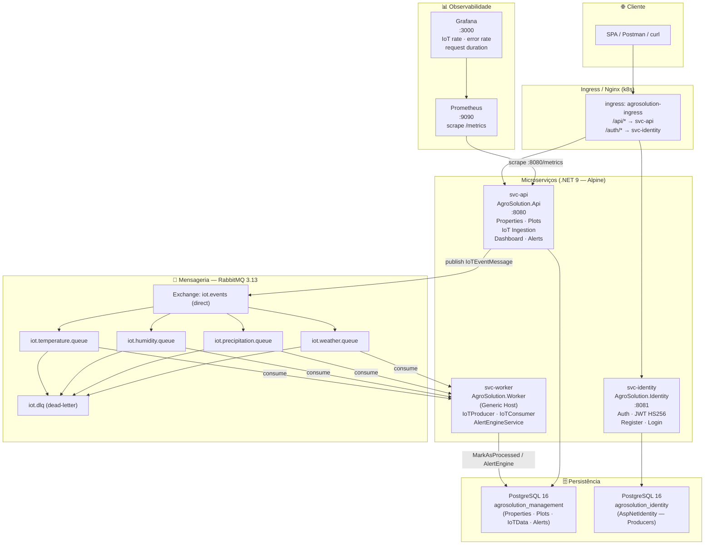
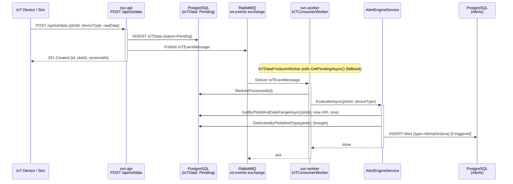
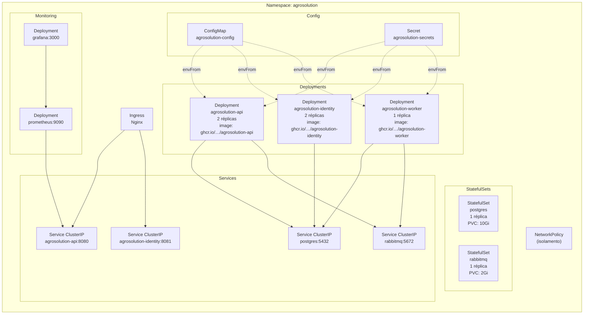
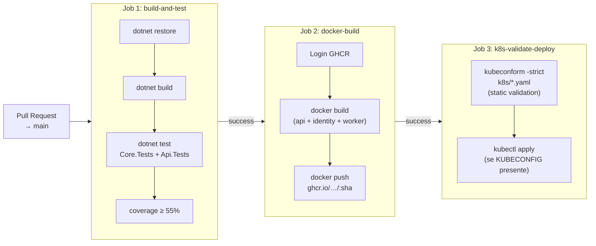
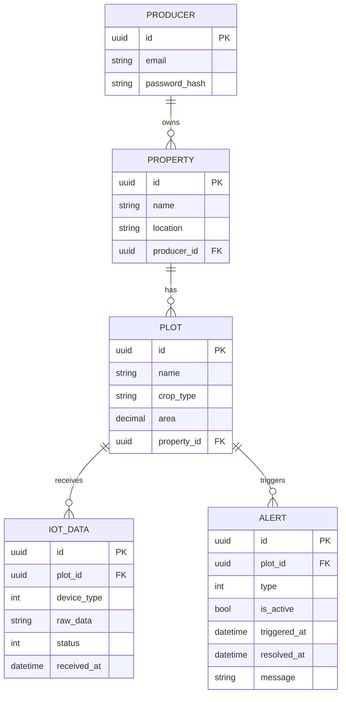

# D-01 — Diagrama de Arquitetura da Solução

> **AgroSolution.Management** — Plataforma IoT de Agricultura de Precisão (Ag 4.0)
> Última atualização: 2026-02-26 | Status: ✅ COMPLETO

---

## 1. Visão Geral dos Serviços (Service Boundaries)

---

## 2. Fluxo de Ingestão de Dados IoT (FR-03 → FR-05)

---

## 3. Topologia Kubernetes (TR-02)

---

## 4. Pipeline CI/CD (TR-05)

---

## 5. Modelo de Domínio Simplificado

---

## 6. Resumo das Fronteiras de Responsabilidade

| Serviço | Entidades Próprias | DB | Porta Interna |
|---|---|---|---|
| `svc-identity` | Producer (AspNet Identity) | agrosolution_identity | 8081 |
| `svc-api` | Property, Plot, IoTData, Alert | agrosolution_management | 8080 |
| `svc-worker` | (sem entidades próprias — acessa management DB via repos) | agrosolution_management | — |
| Prometheus | — | — | 9090 |
| Grafana | — | — | 3000 |
| PostgreSQL | — | ambos schemas | 5432 |
| RabbitMQ | — | — | 5672 / 15672 |

---

## 7. Segurança

- **Autenticação**: JWT HS256, Bearer token em todos os endpoints (exceto `/health` e `/metrics`)
- **[Authorize]**: ativo em todos os 4 controllers da svc-api
- **Secrets**: gerenciados via `Secret` k8s (não versionados); `.env` local para desenvolvimento
- **Non-root containers**: usuário `agro` em todos os Dockerfiles
- **NetworkPolicy**: isolamento de namespace no cluster k8s
