# D-01 — Diagrama de Arquitetura da Solução

> **AgroSolution.Management** — Plataforma IoT de Agricultura de Precisão (Ag 4.0)
> Última atualização: 2026-02-26 | Status: ✅ COMPLETO

---

## 1. Visão Geral dos Serviços (Service Boundaries)

```mermaid
graph TB
    subgraph Client["🌐 Cliente"]
        SPA["SPA / Postman / curl"]
    end

    subgraph Gateway["Ingress / Nginx (k8s)"]
        ING["ingress: agrosolution-ingress\n/api/* → svc-api\n/auth/* → svc-identity"]
    end

    subgraph Services["Microserviços (.NET 9 — Alpine)"]
        API["svc-api\nAgroSolution.Api\n:8080\nProperties · Plots\nIoT Ingestion\nDashboard · Alerts"]
        IDT["svc-identity\nAgroSolution.Identity\n:8081\nAuth · JWT HS256\nRegister · Login"]
        WKR["svc-worker\nAgroSolution.Worker\n(Generic Host)\nIoTProducer · IoTConsumer\nAlertEngineService"]
    end

    subgraph Messaging["📨 Mensageria — RabbitMQ 3.13"]
        EX["Exchange: iot.events (direct)"]
        Q1["iot.temperature.queue"]
        Q2["iot.humidity.queue"]
        Q3["iot.precipitation.queue"]
        Q4["iot.weather.queue"]
        DLQ["iot.dlq (dead-letter)"]
    end

    subgraph Storage["🗄️ Persistência"]
        MGMTDB["PostgreSQL 16\nagrosolution_management\n(Properties · Plots · IoTData · Alerts)"]
        IDTDB["PostgreSQL 16\nagrosolution_identity\n(AspNetIdentity — Producers)"]
    end

    subgraph Observability["📊 Observabilidade"]
        PROM["Prometheus\n:9090\nscrape /metrics"]
        GRAF["Grafana\n:3000\nIoT rate · error rate\nrequest duration"]
    end

    SPA --> ING
    ING --> API
    ING --> IDT

    API -->|"publish IoTEventMessage"| EX
    EX --> Q1 & Q2 & Q3 & Q4
    Q1 & Q2 & Q3 & Q4 -->|"consume"| WKR
    Q1 & Q2 & Q3 & Q4 --> DLQ

    WKR -->|"MarkAsProcessed / AlertEngine"| MGMTDB
    API --> MGMTDB
    IDT --> IDTDB

    PROM -->|"scrape :8080/metrics"| API
    GRAF --> PROM
```

---

## 2. Fluxo de Ingestão de Dados IoT (FR-03 → FR-05)

---

## 3. Topologia Kubernetes (TR-02)

```mermaid
graph LR
    subgraph NS["Namespace: agrosolution"]
        subgraph Deployments
            D_API["Deployment\nagrosolution-api\n2 réplicas\nimage: ghcr.io/…/agrosolution-api"]
            D_IDT["Deployment\nagrosolution-identity\n2 réplicas\nimage: ghcr.io/…/agrosolution-identity"]
            D_WKR["Deployment\nagrosolution-worker\n1 réplica\nimage: ghcr.io/…/agrosolution-worker"]
        end
        subgraph StatefulSets
            SS_PG["StatefulSet\npostgres\n1 réplica\nPVC: 10Gi"]
            SS_RMQ["StatefulSet\nrabbitmq\n1 réplica\nPVC: 2Gi"]
        end
        subgraph Services
            SVC_API["Service ClusterIP\nagrosolution-api:8080"]
            SVC_IDT["Service ClusterIP\nagrosolution-identity:8081"]
            SVC_PG["Service ClusterIP\npostgres:5432"]
            SVC_RMQ["Service ClusterIP\nrabbitmq:5672"]
        end
        subgraph Config
            CM["ConfigMap\nagrosolution-config"]
            SEC["Secret\nagrosolution-secrets"]
        end
        ING2["Ingress\nNginx"]
        NP["NetworkPolicy\n(isolamento)"]

        subgraph Monitoring["Monitoring"]
            PROM2["Deployment\nprometheus:9090"]
            GRAF2["Deployment\ngrafana:3000"]
        end
    end

    ING2 --> SVC_API & SVC_IDT
    D_API --> SVC_PG & SVC_RMQ
    D_IDT --> SVC_PG
    D_WKR --> SVC_PG & SVC_RMQ
    PROM2 --> SVC_API
    GRAF2 --> PROM2
    CM & SEC -.->|"envFrom"| D_API & D_IDT & D_WKR
```

---

## 4. Pipeline CI/CD (TR-05)

```mermaid
flowchart LR
    PR["Pull Request\n→ main"] --> J1

    subgraph J1["Job 1: build-and-test"]
        R1["dotnet restore"] --> B1["dotnet build"]
        B1 --> T1["dotnet test\nCore.Tests + Api.Tests"]
        T1 --> C1["coverage ≥ 55%"]
    end

    J1 -->|"success"| J2

    subgraph J2["Job 2: docker-build"]
        L2["Login GHCR"] --> DB2["docker build\n(api + identity + worker)"]
        DB2 --> P2["docker push\nghcr.io/…/:sha"]
    end

    J2 -->|"success"| J3

    subgraph J3["Job 3: k8s-validate-deploy"]
        KV["kubeconform -strict\nk8s/*.yaml\n(static validation)"]
        KV --> KA["kubectl apply\n(se KUBECONFIG presente)"]
    end
```

---

## 5. Modelo de Domínio Simplificado

---

## 6. Resumo das Fronteiras de Responsabilidade

| Serviço | Entidades Próprias | DB | Porta Interna |
|---|---|---|---|
| `svc-identity` | Producer (AspNet Identity) | agrosolution_identity | 8081 |
| `svc-api` | Property, Plot, IoTData, Alert | agrosolution_management | 8080 |
| `svc-worker` | (sem entidades próprias — acessa management DB via repos) | agrosolution_management | — |
| Prometheus | — | — | 9090 |
| Grafana | — | — | 3000 |
| PostgreSQL | — | ambos schemas | 5432 |
| RabbitMQ | — | — | 5672 / 15672 |

---

## 7. Segurança

- **Autenticação**: JWT HS256, Bearer token em todos os endpoints (exceto `/health` e `/metrics`)
- **[Authorize]**: ativo em todos os 4 controllers da svc-api
- **Secrets**: gerenciados via `Secret` k8s (não versionados); `.env` local para desenvolvimento
- **Non-root containers**: usuário `agro` em todos os Dockerfiles
- **NetworkPolicy**: isolamento de namespace no cluster k8s
